<p align="center">
  
</p>

---

# 🧠 About Me

```yaml
Name: Zoriah Cocio

Title:
  - Software Engineer

Specializations:
  - Frontend Development
  - AI Engineering
  - Runtime Security Systems
  - Interactive Experiences
  - Intelligent Interfaces
  - Real-Time Systems
  - Visualization Platforms

Current Focus:
  - NeuroLens
```

I’m a software engineer focused on building intelligent systems, immersive frontend experiences, runtime observability tooling, and AI-powered interfaces.

My work spans real-time applications, conversational AI systems, client-side security tooling, adaptive interfaces, and interactive visualization platforms.

I enjoy engineering systems that feel:
- immersive
- performant
- visually engaging
- interactive
- intelligent
- human-centered

---

# ⚡ Current Projects

## 🧬 NeuroLens
AI-powered immersive neuroscience and medical education platform combining conversational tutoring, adaptive learning systems, and interactive 3D visualization.

### Vision
- Conversational AI tutoring
- Adaptive learning systems
- Interactive brain visualization
- Voice-guided explanations
- Intelligent educational workflows
- Immersive medical education

---

# 🚀 Engineering Focus

<div align="center">

| Software Engineering | Frontend Development | AI Engineering |
|---|---|---|
| Runtime Systems | Interactive Interfaces | Conversational AI |
| Observability | Motion + Visualization | Adaptive Learning |
| Performance Optimization | Intelligent UX | AI-Assisted Workflows |
| Scalable Architectures | Realtime Experiences | Structured AI Outputs |

</div>

---

# 🛠️ Tech Stack

<div align="center">


</div>

---

# 🌌 Featured Systems

## 🧬 [NeuroLens](https://github.com/codejupiter/neurolens)

AI-powered immersive neuroscience learning platform.

---

## 🛡️ [frontguard-agent](https://github.com/codejupiter/frontguard-agent)

Runtime security and observability agent.

---

## 📈 [ledgerline](https://github.com/codejupiter/ledgerline)

Realtime trading visualization platform.

---

## ⚡ [frontguard](https://github.com/codejupiter/frontguard)

Frontend runtime security tooling.

---

## 🤖 [revassist](https://github.com/codejupiter/revassist)

AI-assisted workflow automation platform.

---

# 📜 Certifications

- HackerRank — Software Engineer
- HackerRank — Frontend (React)
- Salesforce Certified
- Google Cloud AI Engineer
- Google AI Essentials
- Google TensorFlow Developer Certificate
- Stanford University — B.S. Computer Science

---

# 📈 GitHub Activity

<div align="center">


</div>

---

# 🌐 Contribution Graph

<div align="center">


</div>

---

# 🧪 Engineering Philosophy

I’m especially interested in systems where intelligent interaction, visualization, observability, and human-centered design intersect.

I enjoy building technology that feels:
- cinematic
- immersive
- engineered
- responsive
- intentional
- future-facing

---

# 🛰️ Connect

<div align="center">

<a href="https://github.com/codejupiter">

</a>

<a href="https://www.zoriahcocio.com">

</a>

<a href="https://linkedin.com/in/zoriah-cocio">

</a>

</div>

---

<div align="center">

### ⚡ Software engineer building intelligent interactive systems.

</div>
