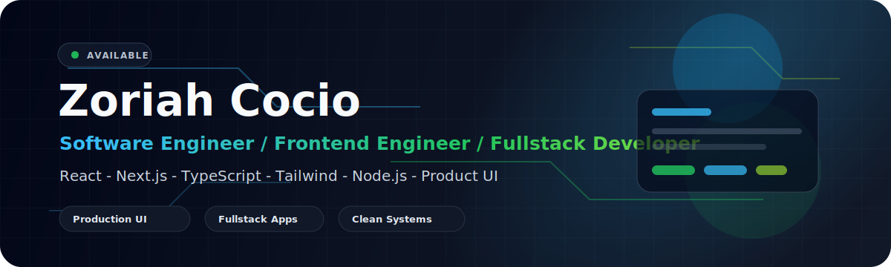

  

  
  
  
  

  

## Software Engineer building modern fullstack products

I build polished interfaces and production-minded web applications with React, Next.js, TypeScript, and modern frontend infrastructure. My work is focused on fast user experiences, clean architecture, real-time interfaces, and tools that feel ready to ship.

Right now I am sharpening a portfolio of product-grade projects across frontend systems, SaaS dashboards, runtime security, AI-assisted workflows, and real-time data visualization.

<table>
  <tr>
    <td><strong>Core focus</strong></td>
    <td>Frontend engineering, product UI, fullstack app architecture, real-time UX</td>
  </tr>
  <tr>
    <td><strong>Current stack</strong></td>
    <td>React, Next.js, TypeScript, Tailwind CSS, Node.js, Vite, PostgreSQL, Vercel</td>
  </tr>
  <tr>
    <td><strong>What I care about</strong></td>
    <td>Performance, accessibility, responsive design, clean state, strong documentation</td>
  </tr>
</table>

## Tech Stack

  

  
  
  
  
  
  

## Featured Work

<table>
  <tr>
    <td width="50%">
      <h3><a href="https://github.com/codejupiter/Dense-UI">Dense UI</a></h3>
      
A compact React component library for data-heavy dashboards, admin panels, and operational tools.

      

        
        
        
      

      
<a href="https://dense-ui.vercel.app">Live docs</a>

    </td>
    <td width="50%">
      <h3><a href="https://github.com/codejupiter/Spendboard">SpendBoard</a></h3>
      
A high-performance finance dashboard rendering 50,000+ transactions with filtering, saved views, charts, and virtualization.

      

        
        
        
      

      
<a href="https://spendboard-beige.vercel.app">Live demo</a>

    </td>
  </tr>
  <tr>
    <td width="50%">
      <h3><a href="https://github.com/codejupiter/frontguard">FrontGuard</a></h3>
      
An interactive frontend security playground for XSS, auth storage, API exposure, RBAC, and client-side bypasses.

      

        
        
        
      

      
<a href="https://frontguard-3dp39xg1r-codejupiters-projects.vercel.app/">Live demo</a>

    </td>
    <td width="50%">
      <h3><a href="https://github.com/codejupiter/Ledgerline">Ledgerline</a></h3>
      
A real-time crypto trading interface with live Binance WebSocket data, candlesticks, order book, trades tape, and FPS telemetry.

      

        
        
        
      

      
<a href="https://ledgerline-omega.vercel.app">Live demo</a>

    </td>
  </tr>
  <tr>
    <td width="50%">
      <h3><a href="https://github.com/codejupiter/frontguard-agent">FrontGuard Agent</a></h3>
      
A lightweight runtime security agent for detecting script injection, iframe injection, and suspicious DOM mutation events.

      

        
        
        
      

      
<a href="https://frontguard-agent.vercel.app">Live demo</a>

    </td>
    <td width="50%">
      <h3><a href="https://github.com/codejupiter/revassist">RevAssist</a></h3>
      
An AI-assisted deal desk interface that turns raw notes into structured deal summaries, add-ons, compliance flags, and customer follow-up copy.

      

        
        
        
      

      
<a href="https://codejupiter.github.io/revassist/">Live demo</a>

    </td>
  </tr>
</table>

## Current Focus

- Building production-quality frontend projects with strong README documentation and live demos.
- Designing dense, fast, accessible UI for dashboards and internal tools.
- Exploring runtime observability, browser security, real-time data, and AI-native product workflows.
- Turning portfolio projects into reusable packages, deployable demos, and clear case studies.

## GitHub Activity

  
  

  

## Contact

I am open to software engineering, frontend engineering, fullstack engineering, and product engineering opportunities.

  <a href="https://zoriahcocio.com">Portfolio</a> /
  <a href="https://linkedin.com/in/zoriah-cocio">LinkedIn</a> /
  <a href="mailto:info@zoriahcocio.com">Email</a>

